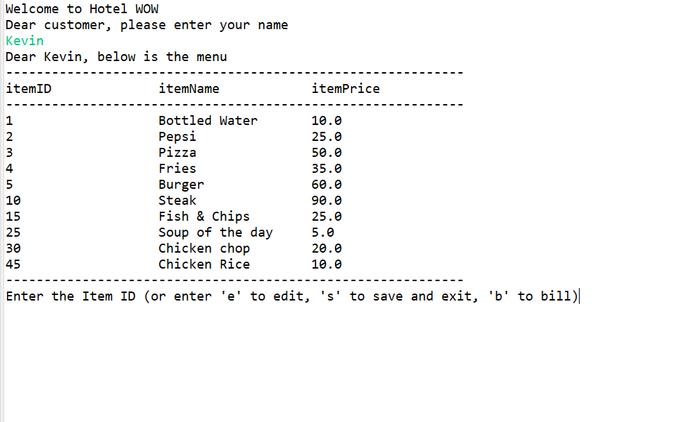

# hotel-billing-app

A command line billing application written in Java that demonstrated clean design, JDBC connectivity and multi-threading

<b>Enhancements on top of the original specficications</b>
<ol>
<li>The menu items originally was hardcoded, I organised the menu items into a array of MenuItem objects and printed them dynamically. So that it is easier to change the menu </li>

  <li>All inputs are validated</li>

<li>There is a second thread running in the background to periodically save the unfinalized receipt into the database. So if the application got terminated suddenly or user chooses to exit, the state can be later retrieved back using the same customer name</li>
</ol>

 

